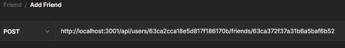
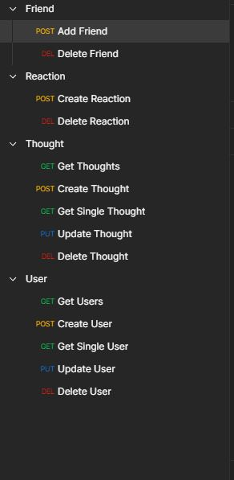

# Social Network API

## Description

This is an API for a social network web application where users can share their thoughts, react to friends' thoughts, and create a friend list. It uses Express.js for routing, a MongoDB database, the Mongoose ODM, and Moment.js to format timestamps. The seed data is created using Postman.

## Table of Contents

- [Installation](#installation)
- [Usage](#usage)
- [Credits](#credits)
- [License](#license)

## Installation

Both Node.jd and MongoDB are used to run this application and Postman is used to insert data. All will need to be installed before use. If you clone the repository, make sure to run npm i in the terminal in order for everything to successfully operate.

## Usage

This is a video showing how the application successfully runs. 

[Usage video here](https://drive.google.com/file/d/1-Q-10DuxnqeFnD0Od7-FYRtxGy7uBKlH/view?usp=sharing)

In the video, you will see all of the CRUD routes in operation towards the top of postman.

A brief description of what each route does is also included on the left hand side.

## License

MIT License

Copyright (c) 2023 Richie Thiesfeldt

Permission is hereby granted, free of charge, to any person obtaining a copy
of this software and associated documentation files (the "Software"), to deal
in the Software without restriction, including without limitation the rights
to use, copy, modify, merge, publish, distribute, sublicense, and/or sell
copies of the Software, and to permit persons to whom the Software is
furnished to do so, subject to the following conditions:

The above copyright notice and this permission notice shall be included in all
copies or substantial portions of the Software.

THE SOFTWARE IS PROVIDED "AS IS", WITHOUT WARRANTY OF ANY KIND, EXPRESS OR
IMPLIED, INCLUDING BUT NOT LIMITED TO THE WARRANTIES OF MERCHANTABILITY,
FITNESS FOR A PARTICULAR PURPOSE AND NONINFRINGEMENT. IN NO EVENT SHALL THE
AUTHORS OR COPYRIGHT HOLDERS BE LIABLE FOR ANY CLAIM, DAMAGES OR OTHER
LIABILITY, WHETHER IN AN ACTION OF CONTRACT, TORT OR OTHERWISE, ARISING FROM,
OUT OF OR IN CONNECTION WITH THE SOFTWARE OR THE USE OR OTHER DEALINGS IN THE
SOFTWARE.

## How to Contribute

If you would like to contribute more to this project, please email me @ richiethie@gmail.com
